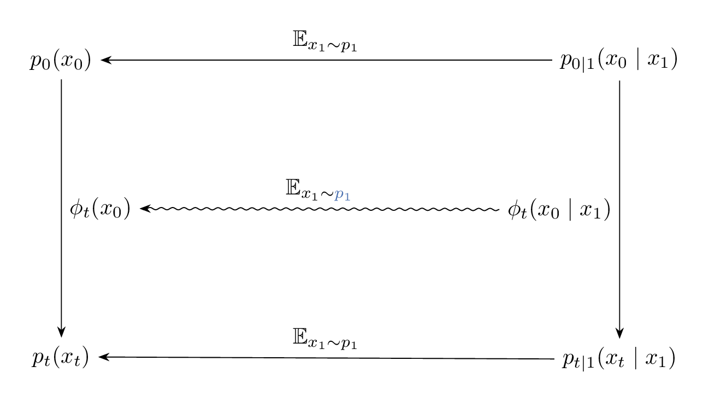
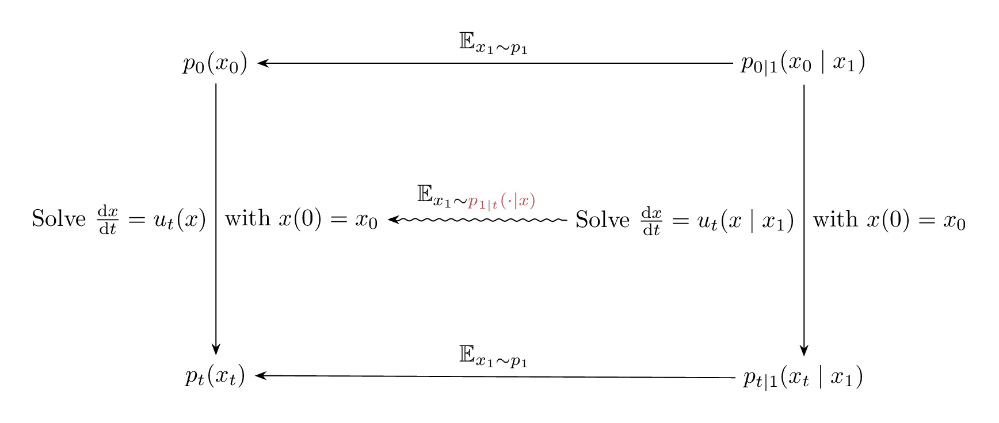
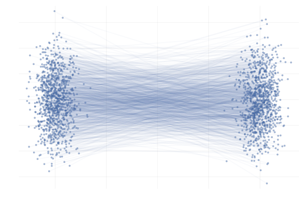
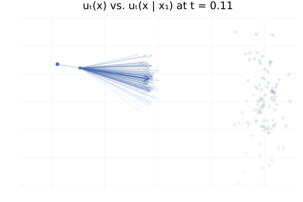
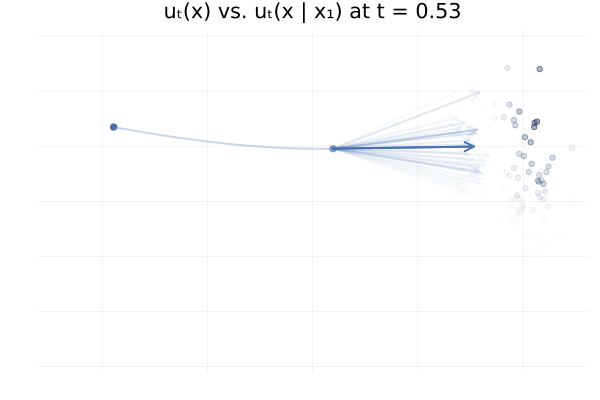

## 1. Giới thiệu

a\. Bối cảnh

Giả sử chúng ta có các mẫu $x_1, x_2, …, x_n$ từ 1 phân phối $q(x)$, trong đó $q(x)$ là phân phối mà ta chưa biết. Từ các mẫu $x_i$ này, ta sẽ muốn tạo ra một mô hình học xác suất xấp xỉ với $q(x)$. Đây được gọi là generative model, với ý tưởng cốt lõi là cố gắng học quá trình sinh dữ liệu ngoài thực tế.

Generative model là một lĩnh vực quan trọng trong trí tuệ nhân tạo và học máy, tập trung vào việc xây dựng các mô hình có khả năng tạo ra dữ liệu mới dựa trên phân phối của dữ liệu huấn luyện. Các kỹ thuật phổ biến bao gồm Generative Adversarial Networks (GANs), nơi một mạng generator tạo dữ liệu giả và một mạng discriminator phân biệt thật-giả để cải thiện chất lượng; Variational Autoencoders (VAEs) sử dụng không gian ẩn để tái tạo dữ liệu; và gần đây là diffusion models, dần dần thêm nhiễu rồi loại bỏ để sinh mẫu mới. Những mô hình này giúp vượt qua hạn chế của dữ liệu hạn chế, mở ra tiềm năng sáng tạo vô hạn.

Ứng dụng của generative modeling ngày càng rộng rãi, từ lĩnh vực hình ảnh như tạo ảnh thực tế (ví dụ: Stable Diffusion) đến văn bản (như GPT models cho viết lách tự động), âm nhạc (tạo giai điệu mới), và y tế (mô phỏng hình ảnh MRI để hỗ trợ chẩn đoán). Trong khoa học dữ liệu, chúng hỗ trợ tăng cường dữ liệu (data augmentation) để cải thiện mô hình học máy. Tuy nhiên, thách thức lớn là kiểm soát chất lượng đầu ra và tránh lạm dụng, như tạo deepfakes. Generative modeling không chỉ thúc đẩy sáng tạo mà còn định hình tương lai của AI, với tiềm năng ứng dụng trong thiết kế sản phẩm, giải trí và nghiên cứu khoa học.

b\. Bài toán

Ý tưởng cốt lõi của các mô hình sử dụng Flow là thực hiện một hàm biến đổi mẫu từ phân phối xác suất nguồn $p_0$ thành mẫu tương ứng thuộc về phân phối xác suất đích $p_1$. ta ký hiệu $\phi: \mathbb{R}^d \to \mathbb{R}^d$ là hàm số biến đổi phần tử thuộc $\mathbb{R}^d$.

$$
\begin{equation*}
\begin{split}
x &\sim p_0 \\
y &= \phi(x),
\end{split}
\end{equation*}
$$

Tức ta có thể thu được $p_1$ bằng cách ánh xạ $p_0$ qua $\phi$. Mục tiêu là tối ưu hóa các tham số $\theta$ của hàm biến đổi $\phi_\theta$ sao cho phân phối $p_1$ được tạo ra phân phối kỳ vọng sát nhất với phân phối dữ liệu thực tế.

## 2. Cơ sở toán học

### 2.1. Khái niệm Flow và Probabilty Path

a\. Định nghĩa

Trong bối cảnh flow matching và continuous normalizing flows (CNFs), Flow ký hiệu $\phi_t$ được hiểu như một họ ánh xạ mô tả sự tiến hóa, biển đổi của điểm trạng thái theo thời gian. Với một trường vận tốc $u(x,t)$, flow $\Psi_t(x_0)$ được định nghĩa là nghiệm tại thời điểm $t$ của phương trình vi phân
$$ \frac{dx}{dt} = v(x,t), \qquad x(0) = x_0. $$

Ánh xạ $\phi_t$ vì thế đóng vai trò như bản đồ tiến hóa từ phân phối ban đầu sang phân phối mục tiêu trong các mô hình CNF và Flow Matching.

Ta gọi một biến xác suất phụ thuộc theo thời gian $(p_t)_{0 \le t \le 1}$ là một đường xác suất (probability path). Với bài toán hiện tại, đường xác suất quan trọng mà ta cần quan tâm là hàm mật độ xác suất tại biên của mô hình flow $X_t = \phi(X_0)$ tại thời điểm t:

$$
X_t  \sim p_t
$$

b\. Tính chất

Tính khả nghịch của flow giữ vai trò đặc biệt quan trọng: khi $\phi$ là song ánh, ta có thể truy vết ngược từ $\phi_t(x_0)$ về trạng thái gốc thông qua ánh xạ ngược $\phi_t^{-1}$, thường được hiện thực bằng việc tích phân trường vận tốc theo chiều thời gian âm. Trong thiết kế của CNF và trong các thuật toán flow matching, tính khả nghịch này bảo đảm rằng các phép biến đổi là khả vi và bảo toàn thông tin, cho phép tính toán chính xác mật độ thông qua công thức biến đổi log-density liên tục.

Một điều kiện thường được sử dụng để đảm bảo sự tồn tại duy nhất của nghiệm ODE, và dể đảm bảo tính song ánh của flow, là trường vận tốc $u(\cdot,t)$ thỏa mãn điều kiện Lipschitz (theo định lý Picard-Lindelöf được nhắc đến ở sau). Tính Lipschitz này ngăn chặn sự hội tụ của các quỹ đạo khác nhau và bảo đảm rằng mỗi điểm đầu có đúng một quỹ đạo tương ứng, điều kiện cốt lõi để flow đóng vai trò như một phép biến đổi khả nghịch trong continuous normalizing flows và trong phân tích lý thuyết của flow matching.

### 2.2. Cơ sở về định lý Biến đối biến (Change of Variables Theorem)

a. Giả thiết và định nghĩa

Giả sử $x$ là một biến ngẫu nhiên liên tục trong không gian $\mathbb{R}^d$ với hàm mật độ xác suất (PDF) là $p_0(x)$. Ta xác định một biến ngẫu nhiên mới $y$ thông qua một ánh xạ 1-1 (song ánh): $y = \phi(x)$, với $\phi: \mathbb{R}^d \to \mathbb{R}^d$. Giả sử $\phi$ là một diffeomorphism (tức là $\phi$ khả nghịch, và cả $\phi$ lẫn $\phi^{-1}$ đều khả vi liên tục). Khi đó, mục tiêu là tìm hàm mật độ xác suất $p_1(y)$ của biến ngẫu nhiên $y$.

b. Nguyên lý bảo toàn xác suất

Theo định nghĩa của xác suất, xác suất để $y$ rơi vào một tập hợp $S \subset \mathbb{R}^d$ phải bằng xác suất để $x$ rơi vào tập hợp nguồn tương ứng $\phi^{-1}(S)$. Với mọi tập đo được $S$, ta có:$$\int_{S} p_1(y) \, dy = P(y \in S) = P(x \in \phi^{-1}(S)) = \int_{\phi^{-1}(S)} p_0(x) \, dx \tag{2.1} $$

c. Định lý đổi biến trong tích phân (Change of Variables Theorem)

Phát biểu: Cho tích phân $\int_{R} f(x) dx$. Nếu ta thực hiện phép đổi biến $x = \psi(y)$ (trong trường hợp này $\psi = \phi^{-1}$), tích phân sẽ được viết lại theo biến $y$ như sau:
$$\int_{R} f(x) \, dx = \int_{\psi^{-1}(R)} f(\psi(y)) \left| \det J_{\psi}(y) \right| \, dy$$
Trong đó:

- $R = \phi^{-1}(S)$ là vùng tích phân theo $x$.
- $\psi^{-1}(R) = \phi(R) = S$ là vùng tích phân theo $y$.
- $J_{\psi}(y)$ là ma trận Jacobi của hàm ngược.

Ta lại có:
$$ J*{\psi}(y) = J*{\phi^{-1}}(y) = \frac{\partial \phi^{-1}}{\partial y}(y) $$

Áp dụng định lý này vào vế phải của phương trình bảo toàn xác suất:
$$\int_{\phi^{-1}(S)} p_0(x) \, dx = \int_{S} p_0(\phi^{-1}(y)) \left| \det \left[ \frac{\partial \phi^{-1}}{\partial y}(y) \right] \right| \, dy \tag{2.2}$$

Kết hợp (2.1) và (2.2) lại, ta được phương trình sau:
$$\int_{S} p_1(y) \, dy = \int_{S} p_0(\phi^{-1}(y)) \left| \det \left[ \frac{\partial \phi^{-1}}{\partial y}(y) \right] \right| \, dy$$

Vì đẳng thức này đúng với mọi tập $S$ đo được, nên hàm dưới dấu tích phân phải bằng nhau. Do đó ta thu được đẳng thức cuối cùng sau:
$$ p_1(y) = p_0(\phi^{-1}(y)) \left| \det \left[ \frac{\partial \phi^{-1}}{\partial y}(y) \right] \right| \tag{2.3} $$

Trong đó:

1.  $\phi(x)$ là hàm biến đổi phân phối nguồn thành phân phối đích.
2.  $\phi^{-1}$ là hàm ngược lại với hàm $\phi$, biến đổi mẫu từ phân phối đích về lại mẫu tương ứng ở phân phối nguồn.
3.  $\frac{\partial \phi^{-1}}{\partial y}(y)$ là Ma trận Jacobian của ánh xạ ngược $\phi^{-1}$.
4.  $\left|\det\left[\cdot\right]\right|$ là giá trị tuyệt đối của định thức Jacobian.

Để dễ tính toán hơn, công thức $(2.3)$ có thể được viết lại dưới dạng:

$$p_1(y) = \frac{p_0(x)}{\left|\det\left[\frac{\partial \phi}{\partial x}(x)\right]\right|} \quad \text{với } x = \phi^{-1}(y) \tag{2.4}$$

### 2.3. Maximum Likelihood Estimation (MLE)

a\. Khái niệm

MLE là phương pháp thống kê được sử dụng để dự đoán các tham số của mô hình, dựa trên dữ liệu sẵn có. Mục tiêu của phương pháp này là tìm bộ tham số được coi là tối ưu, sao cho tối đa hóa khả năng mà mô hình ứng với bộ tham số đó sinh ra các điểm trong dữ liệu.

b\. Likelihood Function

Giả sử ta có các điểm dữ liệu $D = {x_1, x_2, ..., x_n}$ và đã biết các điểm dữ liệu này tuân theo phân phối xác suất nào đó có thể mô tả bằng tham số $\theta$.

MLE có công việc là sẽ tìm ra $\theta$ sao cho xác suất sau đây là giá trị lớn nhất:
$$ \theta = \max_{\theta} p(\mathbf{x_1}, \dots, \mathbf{x_n} | \theta) \tag{2.5}$$

Với giả định là các điểm các biến cố đôi một độc lập với nhau, nên xác suất để thu được tập quan sát $D$ bằng tích của xác suất các điểm riêng lẻ.

Như vậy, hàm Likelihood (Likelihood Function), được định nghĩa là $L(\theta)$ là hàm của tham số $\theta$, biểu thị xác suất của dữ liệu $D$ được tạo ra bởi mô hình dưới tham số $\theta$, được tính với công thức như sau:
$$ L(\theta) = P(D|\theta) = \prod\_{i=1}^n p(x_i|\theta) $$

c\. Log Likelihood Function

Trong thực tế tính toán, hàm $L(\theta)$ thường là tích của nhiều số xác suất rất nhỏ (do xác suất nằm trong $[0, 1]$). Điều này dễ dẫn đến lỗi underflow số học trong máy tính (kết quả bằng 0).

Để khắc phục, ta thường tối đa hóa hàm Log-Likelihood, ký hiệu là $\mathcal{L}(\theta)$. Vì hàm Logarit $\log(\cdot)$ là tăng đơn điệu, việc tối đa hóa $L(\theta)$ hoàn toàn tương đương với việc tối đa hóa $\mathcal{L}(\theta)$.

Hàm Log-Likelihood được tính bằng:
$$\mathcal{L}(\theta) = \log L(\theta) = \log \left( \prod_{i=1}^N p(x_i|\theta) \right)$$
Áp dụng quy tắc Logarit của một tích $\log(a \cdot b) = \log a + \log b$, ta biến tích thành tổng:
$$\mathcal{L}(\theta) = \sum_{i=1}^N \log p(x_i|\theta) \tag{2.6}$$

### 2.4. Hàm Lipschitz

a\. Khái niệm:

Một hàm số $f$ được gọi là Lipschitz liên tục trên một miền $D$ nếu tồn tại một hằng số $K \ge 0$, gọi là Hằng số Lipschitz, sao cho với mọi $x_1$ và $x_2$ trong $D$, ta có:
$$|f(x_1) - f(x_2)| \le K |x_1 - x_2|$$

b\. Ý nghĩa:

Điều kiện này mạnh hơn điều kiện hàm số chỉ liên tục. Nó đảm bảo rằng độ dốc, hay đạo hàm của hàm số được chặn trên bởi hằng số $K$. Điều này có nghĩa là hàm số không thể thay đổi quá nhanh.

### 2.5. Định lý Tồn tại và Duy nhất Picard-Lindelöf (The Picard-Lindelöf Theorem)

a\. Giới thiệu

Định lý tồn tại và duy nhất Picard-Lindelöf, hay có tên khác là Định lý Tồn tại và Duy nhất Cauchy-Lipschitz, là nền tảng trong lý thuyết Phương trình vi phân thường. Nó giải quyết vấn đề về sự tồn tại và duy nhất của nghiệm đối với một bài toán giá trị ban đầu (Initial Value Problem, IVP) cho ODE cấp 1.

Bài toán xét dạng IVP trong bài toán phương trình vi phân như sau:

$$\frac{dy}{dt} = f(t, y), \quad y(t_0) = y_0 \tag{IVP}$$

b\. Phát biểu:

Giả sử $f(t, y)$ là một hàm số xác định trên một hình chữ nhật $R = \{(t, y) : |t - t_0| \le a, |y - y_0| \le b\}$ chứa điểm ban đầu $(t_0, y_0)$.

1.  Điều kiện Tồn tại: Nếu $f(t, y)$ liên tục trên $R$, thì tồn tại ít nhất một nghiệm $y(t)$ cho IVP trên một khoảng thời gian ngắn xung quanh $t_0$.
2.  Điều kiện Duy nhất: Ngoài ra, nếu $f(t, y)$ thỏa mãn điều kiện Lipschitz liên tục đối với biến $y$ trên $R$ (tức là tồn tại $K \ge 0$ $|f(t, y_1) - f(t, y_2)| \le K |y_1 - y_2|$), thì nghiệm $y(t)$ là duy nhất.

c\. Ý nghĩa

Trong việc sử dụng flow như mô hình sinh, tính lipschitz của hàm dịch chuyển $u_t$ đảm bảo rằng flow sẽ có nghiệm duy nhất. Tính duy nhất này đảm bảo cho tính chất khả nghịch trên miền xác định.

### 2.6. Transport Equation / Continuity Equation

a\. Giới thiệu
Transport equation (hay continuity equation) là một phương trình đạo hàm riêng mô tả cách một đại lượng, thường là mật độ xác suất, thay đổi theo thời gian khi nó được vận chuyển bởi một velocity field. Đây là mô hình toán học chuẩn để mô tả sự thay đổi của phân phối trong các hệ động lực liên tục.

b\. Phát biểu
Ta ký hiệu $p_t(x)$ là hàm mật độ xác suất của x tại thời điểm $t$.

Dạng tổng quát của Transport Equation mô tả sự thay đổi theo thời gian của một hàm mật độ xác suất $ p_t(x) $ dưới tác động của một trường vận tốc $u_t(x) $:

$$
\frac{\partial p_t(x)}{\partial t} + \nabla \cdot \left( p_t \, u_t(x) \right) = 0.
$$

c\. Ý nghĩa
Transport equation được sử dụng để:

- Mô tả sự biến đổi của một phân phối xác suất khi nó di chuyển theo một trường vận tốc.
- Làm nền tảng lý thuyết cho các mô hình sinh liên tục như normalizing flows, diffusion models và đặc biệt là flow matching.

Trong flow matching, transport equation cho phép ta hiểu rằng việc học một trường vận tốc thích hợp là đủ để biến đổi phân phối nguồn thành phân phối đích thông qua việc giải một phương trình vi phân.

## 3. Continuous Normalising Flows

### 3.1. Residual Flows

Quay trở lại bài toán ban đầu: ta có một phân phối nguồn với các mẫu $x \sim p_0(x)$, và mục tiêu là tìm một ánh xạ $\phi(x)$ sao cho biến đổi này đưa được mẫu $x$ sang mẫu $y$ tuân theo phân phối mục tiêu $p_1(y)$. Đây chính là bài toán distribution transport: tìm một ánh xạ từ phân phối nguồn sang phân phối đích.

Một cách tiếp cận trực tiếp và mang tính trực quan là chia quá trình biến đổi này thành nhiều bước nhỏ. Thay vì tìm một ánh xạ phức tạp duy nhất, ta xây dựng nó thông qua chuỗi các phép biến đổi đơn giản, mỗi phép biến đổi chỉ điều chỉnh mẫu đầu vào một lượng nhỏ. Đây chính là ý tưởng chính của Residual Flow.

a\. Ý tưởng của Residual Flow

Residual Flow giả định rằng ta có thể xây dựng ánh xạ tổng thể $\phi$ bằng cách ghép nối $K$ biến đổi nhỏ, ký hiệu là:

$$
\phi = \phi_K \circ \cdots \circ \phi_2 \circ \phi_1 .
$$

Ở mỗi bước, biến đổi $\phi_k$ có dạng residual quen thuộc trong deep learning:$\phi_k(x) = x + \delta u_k(x),$

trong đó:

- $x$: đầu vào của bước thứ (k),
- $u_k(x)$: hàm dịch chuyển (hay velocity field) tại bước $k$,
- $\delta > 0$: một hằng số nhỏ, thể hiện “bước tiến” trong không gian.

Hiểu một cách trực quan:

- $u_k(x)$ quyết định hướng và độ lớn của dịch chuyển,
- $\delta$ đảm bảo mỗi bước là “nhỏ”, nhờ đó chuỗi các bước có thể xấp xỉ một flow liên tục (continuous flow),
- việc cộng thêm $x$ giúp mỗi $\phi_k$ giống với một bước Euler rời rạc hóa của một phương trình vi phân.

Do đó, mẫu sẽ được cập nhật theo chuỗi:

$$
x \xrightarrow{\phi_1} x_1 \xrightarrow{\phi_2} x_2 \rightarrow \cdots \xrightarrow{\phi_K} x_K = y.
$$

Mỗi bước chỉ thay đổi mẫu một chút, nhưng ghép lại thì hình thành ánh xạ hoàn chỉnh từ phân phối nguồn sang phân phối mục tiêu.

b\. Log-Likelihood của từng bước trong Residual Flow

Do $x_{k} = \phi_k(x_{k-1})$ nên áp dụng công thức (2.3) và (2.6), ta được hàm Log-Likelihood khi dịch $x_{k-1} \to x_k$:

$$
\mathcal{L_k(\theta)} = \log p_k(x_{k}|\theta) =
\log p_{k-1}(x_{k-1}| \theta) + \log\left| \det \left[ \frac{\partial \phi^{-1}_{k-1}}{\partial x_k}(x_k) \right] \right|
$$

Giải thích:

- $x_{k-1} = \phi_k^{-1}(x_k)$: mẫu trước phép biến đổi,
- $p_{k-1}(x_{k-1})$: mật độ trước bước (k),
- Định thức Jacobi của $\phi_k^{-1}$ mô tả sự thay đổi thể tích của không gian khi điểm được biến đổi qua $\phi_k$.

c\. Log-Likelihood tổng của Residual Flow

Thực hiện quy nạp theo $k$, ta thu được công thức Log-likelihood của cả Flow như sau:

$$
L(\theta)
= \log p_0(x)

+ \sum_{k=1}^K \log \left| \det [
  \frac{\partial \phi_k^{-1}}{\partial x_{k+1}}(x_{k+1})
  ] \right|.
$$

### 3.2. Continuous Normalising Flows (CNFs)

Như đã trình bày ở phần trước, **Residual Flow** được xây dựng như một chuỗi các phép biến đổi rời rạc có dạng:

$$
\phi(x) = x + \delta, u(x)
$$

với $\delta > 0$ là một bước nhỏ. Ta có thể hiểu rằng mỗi phép biến đổi $\phi$ di chuyển điểm $x$ dọc theo hướng của trường vận tốc $u$, với độ dài bước tỉ lệ với $\delta$. Từ biểu thức trên, ta suy ra:

$$
\frac{\phi(x) - x}{\delta} = u(x) \tag{3.1}
$$

Đẳng thức (3.1) có dạng một xấp xỉ sai phân hữu hạn cho đạo hàm của một hàm theo thời gian. Điều này mở đường để diễn giải chuỗi các Residual Flow như xấp xỉ rời rạc của một continuous flow.

a\. Liên hệ với mô tả liên tục theo thời gian

Giờ ta đặt $\delta = \frac{1}{K}$ và xét giới hạn $K \to \infty$. Khi đó, chuỗi $K$ phép biến đổi:

$$
x \xrightarrow{\phi_1} x_1 \xrightarrow{\phi_2} x_2 \cdots \xrightarrow{\phi_K} x_K
$$

sẽ mô phỏng một chuyển động liên tục từ thời điểm (t = 0) đến (t = 1).

Nếu trường vận tốc $u(x)$ là hàm Lipschitz và liên tục, ta có đảm bảo toán học rằng nghiệm của phương trình vi phân tồn tại và duy nhất. Trong trường hợp này, biểu thức (3.1) trở thành xấp xỉ cho đạo hàm theo thời gian:

$$
\frac{{d x_t}}{d t}
= \lim_{\delta \rightarrow 0} \frac{x_{t+\delta} - x_t}{\delta}
= \frac{\phi_t(x_t) - x_t}{\delta}
= u_t(x_t).
$$

Nói cách khác, ta có:

$$
\Leftrightarrow \frac{d\phi_t}{dt} = u_t(\phi_t(x_0)).
$$

Phương trình này cho thấy rằng ánh xạ $\phi_t$ đóng vai trò như họ nghiệm của một phương trình vi phân, trong đó vận tốc của điểm tại thời điểm $t$ phụ thuộc vào trường vận tốc $u_t$.

b\. Họ nghiệm của trường vận tốc

Giải phương trình vi phân này từ $t = 0$ đến thời điểm bất kỳ $t$, ta thu được:

$$
x_t \triangleq \phi_t(x_0)
= x_0 + \int_{0}^t u_s(x_s), ds \tag{3.2}
$$

Biểu thức (3.2) chính là dạng tích phân của nghiệm ODE:

- $x_0$ là điểm ban đầu,
- $u_s(x_s)$ là vận tốc tại vị trí $x_s$ và thời điểm $s$,
- $\phi_t$ là ánh xạ biến đổi điểm đầu $x_0$ sau thời gian $t$.

Như vậy, thay vì xem $\phi_t$ là một phép biến đổi tùy ý, ta có thể xem $\phi_t$ như nghiệm của một quá trình biến đổi liên tục sinh ra bởi trường vận tốc $u_t$. Điều này đưa ta đến Continuous Normalizing Flows và cuối cùng là nền tảng lý thuyết của Flow Matching, nơi việc học trường vận tốc $u_t$ trở thành mục tiêu chính thay vì học từng phép biến đổi rời rạc.

c\. Công thức log-density trong CNFs

Qua trên, ta đã xác định được hàm mapping $\phi_t$, tuy nhiên ta chưa biết khi $x_t$ biến đổi theo $u_t$ thì $p_t$ sẽ biến đổi như thế nào.

Sự thay đổi mật độ xác suất $\log p_t(x_t)$ theo thời gian $t$ được tính thông qua công thức Phương trình Liên tục bằng cách sử dụng độ phân kỳ của trường vectơ $u_t$:

$$
\frac{\partial}{\partial t} \log p_t(x_t) =
- (\nabla \cdot (u_t p_t))(x_t) = - \mathrm{div}\ u_t p_t(x_t)
\tag{3.3}
$$

Suy ra, vi phân toàn phần của $p_t(x_t)$ được tính như sau:

$$
\begin{align*}
\frac{d}{d t} p_t(x_t)
&= \frac{\partial}{\partial_t} p_t(x_t) + \langle \nabla_{x_t} p_t(x_t), \frac{d}{d t} x_t \rangle \\
&= - p_t(x_t) (\nabla \cdot u_t)(x_t) - \langle \nabla_{x_t} p_t(x_t), u_t(x_t) \rangle + \langle \nabla_{x_t} p_t(x_t), \frac{d}{d t} x_t \rangle \\
&= - p_t(x_t) (\nabla \cdot u_t)(x_t).
\end{align*}
$$

Suy ra:

$$
\frac{d}{d t} \log p_t(x_t) = \frac{1}{p_t(x_t)} \frac{d}{d t} p_t(x_t) =
- (\nabla \cdot u_t)(x_t).
\tag{3.4}
$$

Từ đó, log-density của phân phối dữ liệu $p_1(x)$ (tại $t=1$) được tính bằng cách tích phân độ phân kỳ theo thời gian:

$$
\log p_\theta(x) = \log p_0(x_0) - \int_0^1 (\nabla \cdot u_\theta)(x_t) d t
\tag{3.5}
$$

Quá trình này chỉ yêu cầu tính toán độ phân kỳ (divergence) của trường vectơ $u_\theta$, thay vì toàn bộ định thức Jacobi của một phép biến đổi phức tạp, giúp việc tính toán hiệu quả hơn.

d\. Ý nghĩa

Đầu tiên, CNF cho phép xác định số bước trong Residual hiệu quả mà không cần đặt làm siêu tham số. Trong điều kiện liên tục theo thời gian, ta chỉ cần chọn ngưỡng error, và sẽ có một bộ giải mã để đưa ra bước $\delta t$ thích hợp, tương đương với $K$ bước. Với bộ giải mã bậc nhất, mỗi bước có dạng tương tự residual flow, nhưng tham số của kết nối residual được chia sẻ giữa các bước, thay vì mỗi bước có tham số riêng như trong residual flow.

Ngoài ra, CNF giúp yêu cầu Lipschitz dễ thỏa mãn hơn. Trong residual flow, để đảm bảo ánh xạ khả nghịch, trường vận tốc $u$ phải là Lipschitz với hằng số cụ thể, điều này khó kiểm soát trong huấn luyện. Với CNFs, ta vẫn cần $u_t$ là hàm Lipschitz, nhưng không cần quan tâm đến giá trị hằng số Lipschitz chính xác, việc này dễ dàng thực hiện hơn trong kiến trúc mạng neural.

### 3.3. Huấn luyện Continuous Normalizing Flows (CNFs)

Continuous Normalizing Flows (CNFs) được huấn luyện bằng cách cực đại hóa log-likelihood của dữ liệu (maximum likelihood estimation):

$$
\mathcal{L}(\theta) = \mathbb{E}_{x \sim q_{\text{data}}} \left[ \log p_1(x) \right]
$$

trong đó:

- $q_{\text{data}}$ là phân phối dữ liệu thực nghiệm,
- $p_1(x)$ là phân phối của mô hình sau khi đã được đẩy qua toàn bộ quá trình flow (tức tại thời điểm $t=1$),
- $\theta$ là tập hợp tham số của trường vector tham số hóa $u_\theta(t, x)$.

Để tính được giá trị log-likelihood này cũng như gradient của nó theo $\theta$, ta cần giải hệ phương trình vi phân thường (ODE) mô tả sự tiến hóa liên tục của các mẫu $x(t)$ từ phân phối cơ sở $p_0$ (thường là Gaussian chuẩn) đến phân phối đích $p_1$. Cụ thể, việc tính $\log p_t(x_t)$ tại mọi thời điểm $t$ đều yêu cầu:

- Tích phân ngược ODE để đưa các điểm dữ liệu từ $t=1$ trở về $t=0$,
- Tính toán trace của Jacobian (tức độ phân kỳ $\nabla_x \cdot u_\theta(t, x)$) tại nhiều thời gian $t$.

Những yêu cầu trên dẫn tới hai khó khăn lớn trong quá trình huấn luyện:

- Chi phí tính toán rất cao: mỗi bước lan truyền xuôi và lan truyền ngược đều đòi hỏi giải số ODE hàng trăm đến hàng nghìn bước thời gian bằng các bộ giải như Dopri5, RK45, v.v.
- Ước lượng độ phân kỳ trong không gian chiều cao: các phương pháp thông thường thường có phương sai rất lớn khi chiều dữ liệu tăng, khiến việc huấn luyện trở nên không ổn định hoặc cực kỳ chậm.

Mặc dù CNFs có khả năng biểu diễn cực kỳ mạnh, vì chúng tham số hóa một lớp rất rộng các flow liên tục và do đó có thể xấp xỉ gần như mọi phân phối xác suất liên tục nhưng tốc độ huấn luyện lại là điểm nghẽn nghiêm trọng do phải thực hiện phép tích phân ODE ở mỗi iteration của tối ưu. Đây là lúc hướng nghiên cứu Flow Matching ra đời

## 4. Flow Matching

### 4.1. Tổng quan

Sau khi đã thấy rằng, sử dụng CNF mang lại cải tiến hơn so với sử dụng residual flows rời rạc, chẳng hạn như tự động xác định số bước mô phỏng và nới lỏng yêu cầu về hằng số Lipschitz, câu hỏi tự nhiên tiếp theo là: làm thế nào để huấn luyện các mô hình CNF một cách hiệu quả?

Residual flows có thể huấn luyện trực tiếp bằng maximum likelihood, nhưng với CNF, việc tính toán log-likelihood đòi hỏi phải tính các tích phân, vi phân theo thời gian, thường rất tốn kém và không ổn định. Do đó, ta cần một phương pháp huấn luyện không dựa vào flow và tránh phải tính các đạo hàm bậc hai đắt đỏ.

Và đây chính là động lực dẫn đến phương pháp Flow Matching (FM). Flow Matching là một kỹ thuật huấn luyện simulation-free cho CNF: thay vì giải phương trình vi phân để tạo dữ liệu khớp với phân phối xác suất, ta xây dựng trực tiếp một mục tiêu hồi quy cho trường vector tham số $u_\theta(t,x)$. Cụ thể, hàm mất mát được xây dựng như sau:

$$
\mathcal{L_{FM}}(\theta)
= \mathbb{E}_{t \sim \mathcal{U}[0,1],  ~ x \sim p_t}
\left[
|u_\theta(t,x) - u(t,x)|^2
\right]
\tag{4.1}
$$

Ở công thức (4.1), $u(t,x)$ là một vector field mà ta kỳ vọng sẽ sinh ra một probability path $p_t$ nội suy giữa phân phối gốc $p_0$ và phân phối đích $p_1$. Quan hệ giữa chúng thỏa mãn (3.5):

$$
\log p_1(x) = \log p_0(x_0) - \int_0^1 (\nabla \cdot u_t)(x_t) dt
$$

Từ đấy, ta thấy Flow Matching sẽ thực hiện phép hồi quy cho $u_\theta(t,x)$ lên trường vector mục tiêu $u(t,x)$ tại mọi thời điểm $t \in [0,1]$. Một mô hình mạng nơ-ron (Neural network) sẽ được sử dụng để dự đoán trường vector $u(t,x)$ bằng $u_\theta(t,x)$.

Tuy nhiên, điều này đặt ra một vấn đề quan trọng: nếu ta có thể biết được $u(t,x)$, thì rõ ràng sẽ không cần phải huấn luyện mô hình để để dự đoán nữa. Điểm khác biệt của Flow Matching nằm ở chỗ, ta có thể xây dựng một mục tiêu thích hợp cho $u_\theta(t,x)$ mà không cần phải tính tường minh giá trị vector $u(t,x)$ thực sự. Đó là thay vì học flow trên toàn dữ liệu, ta xây dựng các flow cục bộ dựa trên các cặp mẫu $(x_0, x_1)$ và dạy mô hình bắt chước chúng.

### 4.2. Conditional Flow Matching

Từ công thức về quan hệ giữa $p_t$ và $u_t$ ở (3.3), việc xây dựng $p_t$ và $u_t$ sẽ tương đương với nhau, tức nếu ta xây dựng được $u_t$ thì sẽ dựng được $p_t$ và ngược lại.

Trong bài báo Flow Matching For Generative Modeling của Lipman (2023), ông và các cộng sự đã đề xuất một phương pháp để xây dựng flow matching, đó là dựa trên việc xây dựng và kết hợp các đường xác suất (tức probability path) $p_t$ và trường $u_t$ dựa trên xác suất có điều kiện.

#### 4.2.1. Đường xác suất $p_t$ có điều kiện và vector $u_t$ có điều kiện

Nhắc lại đẳng thức (3.3):

$$
\frac{\partial p_t(x)}{\partial t} = - \nabla \cdot \big( u_t p_t(x ) \big).
$$

Từ đây ta có thể nhận xét rằng việc xây dựng $p_t$ và $u_t$ sẽ tương đương nhau: Ứng với mỗi $p_t$ có duy nhất một $u_t$ thỏa mãn việc sinh ra $p_t$.

Giả sử ta có một mẫu dữ liệu đích cụ thể $y_1 \sim q(y)$. Ta định nghĩa $p_t(x|y_1)$ là một đường xác suất có điều kiện (conditional probability path) mô tả quá trình biến đổi của biến $x$ theo thời gian $t \in [0, 1]$, thỏa mãn hai biên:

- Tại thời điểm khởi đầu $t=0$ : $p_0(x|y_1) = p(x)$, trong đó $p(x)$ là phân phối nguồn (ví dụ: phân phối $\mathcal{N}(x|0, I)$).
- Tại thời điểm kết thúc $t=1$ : $p_1(x|y_1)$ là một phân phối đích, tập trung xung quanh mẫu dữ liệu $y_1$ (ví dụ: một phân phối chuẩn với phương sai $\sigma$ rất nhỏ: $\mathcal{N}(x|y_1, \sigma^2 I)$).

Tương ứng với mỗi đường xác suất có điều kiện $p_t(x|y_1)$, tồn tại một trường vector có điều kiện $u_t(x|y_1): \mathbb{R}^d \rightarrow \mathbb{R}^d$ đóng vai trò sinh ra flow đó. Dưới điều kiện ta đã biết trước đích đến $x_1 = y_1$ của quá trình chuyển dịch, ta có thể dễ dàng xây dựng các đường xác suất và trường vector tương ứng. Ví dụ giả sử điểm đến tại $t = 1$ là $x_1 = y_1$, ta có thể xây dựng công thức như sau:

$$
x_t = (1 - t) * x_0 + t * x_1
\\
u_t = \frac{d x_t}{d t} = x_1 - x_0
$$

#### 4.2.2. Đường xác suất và trường vector tổng quát

Qua các công thức trên ta thấy rằng để tính $u_t$ và $p_t$ trong điều kiện đã biết điểm đến là không khó. Như vậy bài toán bây giờ đặt ra là, làm sao từ các flow có điều kiện này, ta tính ra được flow tổng trên toàn tập dữ liệu. Với đường xác suất tổng quát, từ các đường xác suất có điều kiện này, ta có thể khôi phục lại đường xác suất cận biên (marginal probability path) $p_t(x)$ cho toàn bộ không gian dữ liệu bằng cách lấy tích phân biên qua phân phối dữ liệu $q(y_1)$:

$$
p_t(x)
 = \mathbb{E}_{y_1 \sim q} \left[ p_t(x \mid y_1) \right]
 = \int p_{t \mid 1}(x|y_1)q(y_1)dy_1
 \tag{4.2}
$$

Công thức này xác định $p_t(x)$ bằng cách coi nó là sự tổng hợp của các phân phối xác suất. Đặc biệt tại $t=1$, $p_1(x)$ sẽ có thể xấp xỉ tốt đối với phân phối dữ liệu thực tế $q(x)$ nhờ sự tổng hợp của các phân phối con tập trung quanh từng điểm dữ liệu.

Tuy nhiên, Lipman (2023) đã chứng minh rằng không thể chỉ đơn giản lấy trung bình cộng của tất cả các vector có điều kiện đã tính được. Ở đây, trường vector tại biên (marginal vector field) được định nghĩa thông qua công thức kỳ vọng có trọng số như sau (giả sử $p_t(x) > 0$) như sau:

$$u_t(x)  = \mathbb{E}_{y_1 \sim p_{1 \mid t}} \left[ p_t(x \mid y_1) \right] = \int u_t(x|y_1) \frac{p_t(x|y_1)q(y_1)}{p_t(x)} dy_1 \tag{4.3}$$

Trong đó, tỷ số $\frac{p_t(x|y_1)q(y_1)}{p_t(x)}$ đóng vai trò như xác suất hậu nghiệm (posterior), xác định mức độ đóng góp của flow từ điểm $y_1$ vào vị trí $x$ tại thời điểm $t$.

Để chứng minh công thức kết quả vector tại biên $u_t$ nhận được sẽ sinh ra đường xác suất tại biên $p_t$, đầu tiên, Lipman đã chứng minh đẳng thức (3.3) đúng với đường xác suất có điều kiện và trường vector có điều kiện:

$$
\frac{\partial p_t(x \mid x_1)}{\partial t} = - \nabla \cdot \big( u_t p_t(x \mid x_1) \big)
\tag{4.4}
$$

Sau đó triển khai công thức (4.2) và (4.4) như sau:

$$
\begin{align*}
\frac{\partial p_t(x)}{\partial t}
&= \frac{\partial}{\partial t} \int p_t(x \mid y_1) q(y_1)\, dy_1 \\
&= \int \frac{\partial}{\partial t}\big( p_t(x \mid y_1) \big) q(y_1)\, dy_1 \\
&= - \int \nabla \cdot \big( u_t(x \mid y_1) p_t(x \mid y_1) \big) q(y_1)\, dy_1 \\
&= - \nabla \cdot \int u_t(x \mid y_1) p_t(x \mid y_1) q(y_1)\, dy_1 \\
&= - \nabla \cdot \left(
        \int u_t(x \mid y_1)\,
        \frac{p_t(x \mid y_1) q(y_1)}{p_t(x)}\,
        p_t(x)\, dy_1
     \right) \\
&= - \nabla \cdot \bigg(
        \left[
            \int
            u_t(x \mid y_1)
            \frac{p_t(x \mid y_1) q(y_1)}{p_t(x)}\, dy_1
        \right]
        p_t(x)
     \bigg) \\
&= - \nabla \cdot \big( u_t(x)\, p_t(x) \big)
\tag{Q.E.D}
\end{align*}
$$

Để có thể mô tả trực quan hơn, ta xét việc áp dụng bài toán chuyển đổi phân phối Gauss thành 1 phân phối Gauss (G-to-G) khác như sau:

$$
\begin{equation}
\tag{G-to-G}
\begin{split}
p_0 = \mathcal{N}([-\mu, 0], I) \quad & \text{và} \quad p_1 = \mathcal{N}([+\mu, 0], I) \\
\text{với} \quad \phi_t(x_0 \mid x_1) &= (1 - t) x_0 + t x_1
\end{split}
\end{equation}
$$

Trong hình dưới, 2 phân phối Gauss của ta là 2 cụm điểm ở 2 bên trái phải của ảnh. Các đường nối các điểm giữa chúng là một ví dụ của các đường được tạo nên nhờ vết do $u_t(x|y_1)$ tạo ra khi di chuyển các điểm tương ứng.

Sau đó, ta muốn rằng có thể học được các đường tại biên $\phi_t(x_0)$ với $x_0$ là điểm xuất phát, có phân phối xác suất gốc là $p_0$, sao cho chúng sẽ sinh ra được $x_1 = y_1 = \phi_1(x_0)$. Trong ví dụ đơn giản này, chúng ta có thể tìm được các biểu thức dạng đóng cho $\phi_t(x_0)$ tương ứng với các đường có điều kiện $\phi_t(x_0 \mid x_1)$ của (G-to-G) , như được minh họa bên dưới:

Trên tinh thần đó, ta thực hiện như sau: Chọn điểm $x_0$ ngẫu nhiên từ $p_0$, sau đó ước lượng $u_t(x_0)$ với $t \in [0,1]$:

$$
\begin{equation*}
\begin{split}
u_t \big( \phi_t(x_0) \big)
&= \mathbb{E}_{p_{1 \mid t}}\left[u_t \big( \phi_t(x_0) \mid x_1 \big)\right] \\
&\approx \frac{1}{n} \sum_{i = 1}^n u_t \big( \phi_t(x_0) \mid x_1^{(i)} \big) \ \text{với } x_1^{(i)} \sim p_{1 \mid t}(x_1 \mid \phi_t(x_0)).
\end{split}
\end{equation*}
$$

Trong thực tế, ta không thể biết được cụ thể $p_{1|t}(x_1 \mid x_t)$, nhưng trong bài toán với thiết lập cụ thể này ta lại có biểu thức cần tính này. Do đó, chúng ta có thể trực quan hóa trường vectơ biên $u_t(\phi_t(x_0))$ và các trường vectơ có điều kiện $u_t(\phi_t(x_0) \mid x_1^{(i)})$ cho tất cả các mẫu “dữ liệu” $x_1^{(i)}$, rồi xem chúng khác nhau như thế nào. Điều này được minh hoạ trong hình dưới đây.

|                                   |                                   |
| --------------------------------- | --------------------------------- |
|  |  |

#### 4.2.3. Hàm mất mát

Thay (4.3) vào (4.1), ta được kết quả sau:

$$
\begin{equation*}
\mathcal{L}_{\mathrm{CFM}}(\theta) = \mathbb{E}_{t \sim \mathcal{U}[0, 1], y_1 \sim q, x_t \sim p_t(x \mid y_1)}\left[\|
u_\theta(t, x) - u_t(x \mid y_1) \|^2 \right].
\end{equation*}
\tag{4.5}
$$

Ta sẽ chứng minh rằng:

$$
\begin{equation*}
\nabla_\theta \mathcal{L}_{\mathrm{FM}}(\theta) = \nabla_\theta \mathcal{L}_{\mathrm{CFM}}(\theta),
\end{equation*}
\tag{4.6}
$$

Thật vậy, lần lượt triển khai phá bình phương trong mỗi hàm mất mát:

$$
\|u_\theta(t, x) - u_t(x \mid y_1)\|^2 = \|u_\theta(t, x)\|^2 + \|u_t(x \mid y_1)\|^2 - 2 \langle u_\theta(t, x), u_t(x \mid y_1) \rangle \tag{4.7}
$$

$$
\|u_\theta(t, x) - u_t(x)\|^2 = \|u_\theta(t, x)\|^2 + \|u_t(x)\|^2 - 2 \langle u_\theta(t, x), u_t(x) \rangle \tag{4.8}
$$

Thay vào công thức của từng hàm, ta sẽ chứng minh:

$$
\mathbb{E}_{x \sim p_t} ~\langle u_\theta(t, x), u_t(x) = \mathbb{E}_{y_1 \sim q_1, x \sim p_t(x|y_1)} ~\langle u_\theta(t, x), u_t(x \mid y_1) \rangle
\\
\mathbb{E}_{p_t} \|u_\theta(t, x)\|^2 = \mathbb{E}_{q_1(y_1) p(x \mid y_1)} \|u_\theta(t, x)\|^2
$$

Thật vậy:

$$
\begin{equation*}
\mathbb{E}_{p_t} \|u_\theta(t, x)\|^2 = \int \|u_\theta(t, x)\|^2 p_t(x \mid y_1) q(y_1) dx d y_1 = \mathbb{E}_{q_1(y_1) p(x \mid y_1)} \|u_\theta(t, x)\|^2
\end{equation*}
$$

$$
\begin{align*}
    \mathbb{E}_{x \sim p_t} ~\langle u_\theta(t, x), u_t(x) \rangle
    &= \int \langle u_\theta(t, x), \int u_t(x|y_1) \frac{p_t(x \mid y_1)q(y_1)}{p_t(x)} dy_1 \rangle p_t(x) dx \\
    &= \int \langle u_\theta(t, x), \int u_t(x \mid y_1) p_t(x \mid y_1)q(y_1) dy_1 \rangle dx \\
    &= \int \int \langle u_\theta(t, x), u_t(x \mid y_1) \rangle p_t(x \mid y_1)q(y_1) dy_1 dx \\
    &= \mathbb{E}_{y_1 \sim q_1, x \sim p_t(x|y_1)} ~\langle u_\theta(t, x), u_t(x \mid y_1) \rangle. \tag{Q.E.D}
    \end{align*}
$$

Vậy từ công thức (4.6), việc tối ưu hàm mất mát của Flow Matching sẽ tương đương với việc tối ưu hàm mất mát của Conditional Flow Matching. Kết quả này cho phép chúng ta huấn luyện CNF để mô phỏng đường xác suất biên $p_t$, qua đó xấp xỉ phân phối dữ liệu chưa biết $q$ tại thời điểm $t=1$, mà không cần đến bất kỳ thông tin trực tiếp về đường xác suất biên hoặc trường vectơ biên. Do đó, vấn đề cốt lõi chỉ còn nằm ở việc xây dựng các đường xác suất có điều kiện cùng các trường vectơ tương ứng sao cho phù hợp.

#### 4.2.4. Hạn chế

Mặc dù CFM là một bước tiến lớn giúp việc huấn luyện CNF trở nên khả thi và ổn định hơn, phương pháp này vẫn tồn tại những điểm yếu và hạn chế nhất định.

1. Vấn đề về Tốc độ Lấy mẫu

Đây là điểm yếu chung của tất cả các mô hình dựa trên phương trình vi phân. Để sinh ra một mẫu dữ liệu mới, mô hình phải giải một phương trình vi phân đi từ thời điểm $t=0$ đến $t=1$. Việc này đòi hỏi sử dụng các cách giải tích phân như Euler hay Runge-Kutta. Quá trình này yêu cầu gọi mạng nơ-ron nhiều lần (hàng chục đến hàng trăm bước) cho mỗi mẫu sinh ra.

2. Vấn đề giao nhau của các đường dẫn

Trong phần cơ bản của CFM, đặc biệt là khi sử dụng Independent Coupling, ghép cặp ngẫu nhiên giữa nguồn $x_0$ và dữ liệu đích $x_1$, sẽ thường xảy ra việc các đường xác suất có điều kiện sẽ đan xen và cắt nhau chằng chịt.

Điều này dẫn đến việc, dù mỗi đường xác suất đơn lẻ thì đơn giản (ví dụ: đường thẳng), nhưng trường vector biên $u_t(x)$ mà mạng nơ-ron phải học, lại trở nên cực kỳ phức tạp vì nó là trung bình của các hướng đi hỗn loạn này. Điều này làm cho hàm mục tiêu khó tối ưu hơn và mạng nơ-ron cần dung lượng lớn hơn để học chính xác.

Ngoài ra, do hàm được mạng nơ-ron học $u_\phi(t,x)$ sao cho nó xấp xỉ $u(t, x)$ (trường vector biên).
Tuy nhiên, $u(t, x)$ được định nghĩa là kỳ vọng (tích phân) của các trường vector có điều kiện: $u_t(x) = \mathbb{E}[u_t(x|z)]$, nên tại các vùng không gian mà các đường $u_t(x|z)$ có phương sai lớn, mạng nơ-ron sẽ có xu hướng học giá trị trung bình và làm "mờ" đi độ chính xác, chi tiết của flow, dẫn đến chất lượng sinh mẫu có thể bị ảnh hưởng.

#### 4.3. Coupling

### 4.4. Discrete Flow Matching

## Tham khảo

1. https://arxiv.org/pdf/2210.02747
2. https://mlg.eng.cam.ac.uk/blog/2024/01/20/flow-matching.html
3. https://arxiv.org/abs/2412.06264
